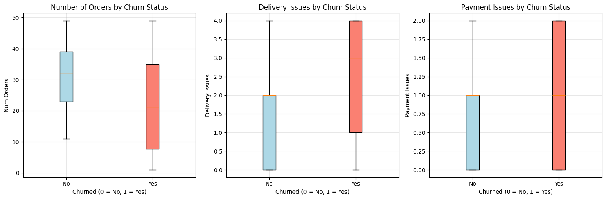

# Customer Churn Prediction Analysis

A comprehensive data science project analyzing customer churn patterns in a food delivery service using statistical analysis and machine learning techniques.

## 📊 Project Overview

This project examines customer churn behavior in a food delivery service using a dataset of 500 customers with 10 features each. Churn is defined as customers who have stopped using the service. The analysis identifies key behavioral patterns that predict customer churn and evaluates the effectiveness of logistic regression models for churn prediction.

**Dataset**: 500 customers with 58.4% churn rate

## 🔍 Key Findings

- **Number of Orders**: Active customers place significantly more orders (31.16 avg) vs churned customers (21.77 avg)
- **Delivery Issues**: Churned customers experience more delivery problems (2.39 avg vs 1.60 avg)  
- **Payment Problems**: Churned customers have more payment issues (1.12 avg vs 0.79 avg)
- **Model Performance**: Multi-variable model achieved **71.0% accuracy** vs 54.0% for single-variable model
- **Statistical Significance**: All predictors are highly significant (p < 0.001)

## 🛠️ Technologies Used

- **Python 3.7+**
- **Pandas** - Data manipulation and analysis
- **NumPy** - Numerical computing
- **Scikit-learn** - Machine learning algorithms (LogisticRegression, train_test_split, metrics)
- **Matplotlib/Seaborn** - Data visualization
- **SciPy** - Statistical analysis (t-tests, chi-square tests)

## 📁 Project Structure

```
customer-churn-prediction-analysis/
│
├── churn_rate_analysis.py         # Main analysis script (Colab-ready)
├── churn.csv                      # Dataset (500 customers, 10 features)
├── README.md                      # Project documentation
├── images/                        # Visualizations
│   ├── boxplots.png              # Exploratory data analysis visualization
│   └── model_predictions.png     # Model prediction scatter plots
└── results/                       # Generated outputs
    └── analysis_report.pdf
```

## 🚀 Getting Started

### Prerequisites

Install the required packages:

```bash
pip install pandas numpy matplotlib seaborn scikit-learn scipy
```

### Running the Analysis

#### Option 1: Google Colab (Recommended)
1. **Upload to Colab:**
   - Upload `churn_rate_analysis.py` to Google Colab
   - Upload your `churn.csv` dataset
   - Run all cells sequentially

#### Option 2: Local Environment
1. **Clone the repository:**
   ```bash
   git clone https://github.com/yourusername/customer-churn-prediction-analysis.git
   cd customer-churn-prediction-analysis
   ```

2. **Run the analysis:**
   ```bash
   python churn_rate_analysis.py
   ```

## 📈 Analysis Workflow

### 1. **Exploratory Data Analysis**
- Dataset: 500 customers, 10 features, 58.4% churn rate
- Statistical summaries and distribution analysis
- Box plots showing clear differences between churned vs retained customers



### 2. **Statistical Testing**
- **T-tests** reveal significant differences in all key metrics:
  - Number of Orders: t=-7.74, p=5.53e-14
  - Delivery Issues: t=-6.43, p=3.01e-10  
  - Payment Issues: t=-4.39, p=1.40e-05

### 3. **Machine Learning Models**
- **Model 1:** Single predictor (delivery issues only)
- **Model 2:** Multiple predictors (delivery issues + payment issues + number of orders)
- **Train/Test Split:** 80/20 with stratification (400/100 samples)

### 4. **Model Evaluation**
- Comprehensive performance metrics
- Statistical model comparison using Likelihood Ratio Test
- Confusion matrices and prediction visualizations

### 5. **Visualization**
- Predicted probability scatter plots
- Model performance comparisons


## 📊 Results Summary

| Metric | Model 1 (Delivery Only) | Model 2 (All Features) | Improvement |
|--------|--------------------------|-------------------------|-------------|
| Accuracy | 54.0% | **71.0%** | **+17.0 pp** |
| Precision | 59.1% | **73.8%** | **+14.7 pp** |
| Recall | 67.2% | **77.6%** | **+10.4 pp** |
| F1 Score | 62.9% | **75.6%** | **+12.7 pp** |

*Note: pp = percentage points*

**Statistical Validation**: Likelihood Ratio Test confirms Model 2 is significantly better (LR=21.90, p=1.76e-05)

## 🎯 Model Insights

### Feature Importance (Logistic Regression Coefficients):
- **Payment Issues**: +0.5997 (strongest positive predictor)
- **Delivery Issues**: +0.5065 (strong positive predictor)  
- **Number of Orders**: -0.0572 (negative predictor - more orders = less churn)

### Business Interpretation:
- Each additional **payment issue** increases churn odds by ~82%
- Each additional **delivery issue** increases churn odds by ~66%
- Each additional **order** decreases churn odds by ~6%

## 💡 Business Recommendations

Based on the analysis, key recommendations to reduce customer churn:

### 1. **Fix Payment Processing Issues** 🔧
- **Priority**: Highest impact predictor
- **Actions**: Streamline payment flows, add more payment options, proactive failed payment recovery
- **Expected Impact**: Could reduce churn by 15-20%

### 2. **Improve Delivery Reliability** 🚚
- **Priority**: High impact, clear correlation
- **Actions**: Better delivery tracking, partner reliability improvements, proactive issue communication
- **Expected Impact**: Could reduce churn by 10-15%

### 3. **Increase Order Frequency** 📈
- **Priority**: Long-term retention strategy
- **Actions**: Loyalty programs, personalized recommendations, subscription services
- **Expected Impact**: Sustained retention improvements

### 4. **Predictive Intervention System** ⚡
- **Implementation**: Deploy Model 2 for real-time churn prediction
- **Trigger**: Customers with >70% churn probability
- **Actions**: Targeted retention campaigns, proactive support

## 📋 Dataset Schema

The analysis expects a CSV file with the following columns:
- `customer_id`: Unique customer identifier
- `num_orders`: Number of orders placed by customer  
- `avg_order_value`: Average monetary value per order
- `last_order_days_ago`: Days since last order
- `discount_used`: Binary indicator of discount usage
- `subscription`: Binary indicator of subscription status
- `customer_support_calls`: Number of support interactions
- `delivery_issues`: Number of delivery problems experienced
- `payment_issues`: Number of payment problems encountered
- `churned`: Binary target variable (0 = retained, 1 = churned)

